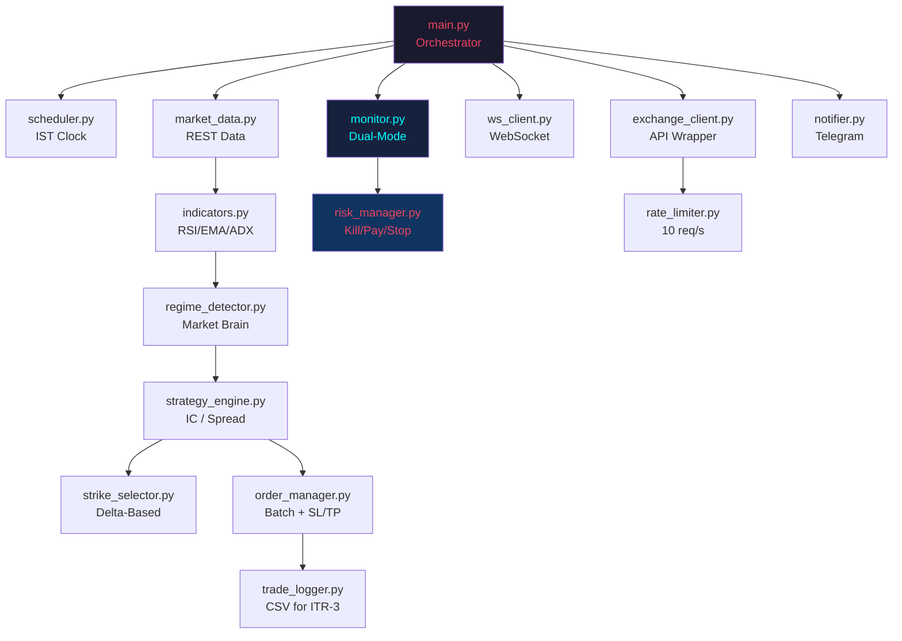

# Operation Daily Profit – Walkthrough

## What Was Built

A fully autonomous BTC options trading bot for Delta Exchange India — **18 Python modules** across 7 phases — targeting ₹500–₹1,000 daily profit on a ₹1,20,000 margin.

## Architecture



## File Inventory (18 files)

| File | Size | Purpose |
|---|---|---|
| [config.py](file:///c:/code/delta_trader/config.py) | 7.6 KB | Constants, thresholds, enums, dataclasses |
| [exchange_client.py](file:///c:/code/delta_trader/exchange_client.py) | 12.0 KB | API wrapper with retry + rate limiting |
| [market_data.py](file:///c:/code/delta_trader/market_data.py) | 10.0 KB | Candles, option chains, Greeks, IV Rank |
| [ws_client.py](file:///c:/code/delta_trader/ws_client.py) | 8.4 KB | WebSocket streaming, auto-reconnect |
| [rate_limiter.py](file:///c:/code/delta_trader/rate_limiter.py) | 2.2 KB | Token-bucket throttle (10 req/s) |
| [indicators.py](file:///c:/code/delta_trader/indicators.py) | 3.0 KB | RSI, EMA, ADX via pandas_ta |
| [regime_detector.py](file:///c:/code/delta_trader/regime_detector.py) | 3.5 KB | Sideways/Bullish/Bearish classification |
| [strike_selector.py](file:///c:/code/delta_trader/strike_selector.py) | 5.2 KB | Delta-based strike selection |
| [strategy_engine.py](file:///c:/code/delta_trader/strategy_engine.py) | 6.9 KB | Iron Condor + Credit Spread builder |
| [order_manager.py](file:///c:/code/delta_trader/order_manager.py) | 11.0 KB | Batch orders, exchange-side SL/TP, rolling |
| [risk_manager.py](file:///c:/code/delta_trader/risk_manager.py) | 7.5 KB | Kill switch, PayDay, breaches, stop-loss |
| [scheduler.py](file:///c:/code/delta_trader/scheduler.py) | 4.2 KB | IST clock, weekend blackout, deploy time |
| [monitor.py](file:///c:/code/delta_trader/monitor.py) | 10.3 KB | Adaptive polling, WS + REST dual-mode |
| [notifier.py](file:///c:/code/delta_trader/notifier.py) | 7.9 KB | Telegram heartbeat + alerts |
| [trade_logger.py](file:///c:/code/delta_trader/trade_logger.py) | 4.9 KB | CSV logger for ITR-3 |
| [main.py](file:///c:/code/delta_trader/main.py) | 13.0 KB | Top-level orchestrator |
| [requirements.txt](file:///c:/code/delta_trader/requirements.txt) | 205 B | Dependencies |
| [.env.example](file:///c:/code/delta_trader/.env.example) | 373 B | API key template |

## Key Design Decisions

### User-Requested Enhancements Implemented

1. **WebSocket Streaming** — `ws_client.py` receives real-time price pushes from Delta Exchange instead of polling. Auto-reconnects with exponential backoff. Falls back to REST if WS fails.

2. **Strategy-Adaptive Polling** — Iron Condor polls every 90s (wide buffers), Credit Spreads every 45s (tighter, needs faster reaction).

3. **Exchange-Side Hard SL/TP** — After entry fill, `order_manager.py` places stop-loss and take-profit orders directly on Delta's servers. They execute even if the bot crashes.

4. **Rate Limiter** — `rate_limiter.py` uses a token-bucket algorithm (10 req/s) wrapping all API calls. Warns at 80% capacity.

5. **Telegram Heartbeat** — `notifier.py` sends "I am alive" messages every hour with PnL, positions, and strategy. Instant alerts for kills, paydays, breaches.

### Safety Doctrine

| Safeguard | Threshold | Location |
|---|---|---|
| Kill Switch | ≤ -₹3,000 unrealized | `risk_manager.py` |
| PayDay Exit | ≥ ₹1,200 gross | `risk_manager.py` |
| Per-Leg Stop | 2.5× premium | `risk_manager.py` |
| Margin Cap | ≤ 60% of capital | `order_manager.py` |
| Weekend Blackout | Fri 5 PM – Mon 9 AM IST | `scheduler.py` |
| Exchange-Side SL | On Delta servers | `order_manager.py` |

## Setup Instructions

```powershell
# 1. Install Python 3.11+
# 2. Navigate to project
cd c:\code\delta_trader

# 3. Install dependencies
pip install -r requirements.txt

# 4. Configure API keys
copy .env.example .env
# Edit .env with your Delta Exchange India testnet keys

# 5. Run (testnet first!)
python main.py
```

> [!IMPORTANT]
> Set `USE_TESTNET=true` in `.env` for testing. Only switch to `false` after validating on testnet.

## Verification Results

| Check | Result |
|---|---|
| Python Version | 3.12.10 |
| pip Dependencies | 42/42 installed |
| Syntax Check | **16/16 passed** |
| Module Imports | **16/16 passed** |
| Functional Tests | **42/42 passed** |
| API Connectivity | ✅ Testnet reachable |

### Functional Tests Breakdown

| Test Suite | Tests | Status |
|---|---|---|
| Technical Indicators | 4 | ✅ RSI, EMA, ADX computed correctly |
| Regime Detection | 5 | ✅ Sideways, Bullish, Bearish, IV check |
| Strike Selector | 3 | ✅ Delta-based selection, 4-leg IC |
| Strategy Engine | 4 | ✅ IC + Credit Spread construction |
| Risk Manager | 9 | ✅ Kill switch, PayDay, stop loss, evaluation |
| Scheduler | 10 | ✅ Blackout, deploy window, adaptive polling |
| Trade Logger | 2 | ✅ CSV write and daily summary |
| Rate Limiter | 2 | ✅ Throughput and decorator |
| Notifier | 2 | ✅ Graceful degradation without Telegram |
| API Connectivity | 1 | ✅ Testnet reachable |
